## 🍔 项目介绍

源计划智能工厂MES系统(开源版)

功能包括销售管理，仓库管理，生产管理，质量管理，设备管理，条码追溯，财务管理，系统集成，移动端APP。

#### [点击跳转开源版视频教程](https://www.bilibili.com/video/BV1wL41167px/?share_source=copy_web&vd_source=071165d33d12b871a28101358940c53f)

#### [点击跳转商业版介绍](https://www.bilibili.com/video/BV1Zt421V7NA/?share_source=copy_web&vd_source=071165d33d12b871a28101358940c53f)

#### 演示地址

PC端 http://mes.cpolar.cn

移动端 http://mes.cpolar.cn/h5/index.html

添加微信【**jinzhong373**】 获取体验账号。

## 🛸 技术框架
#### 业务流程

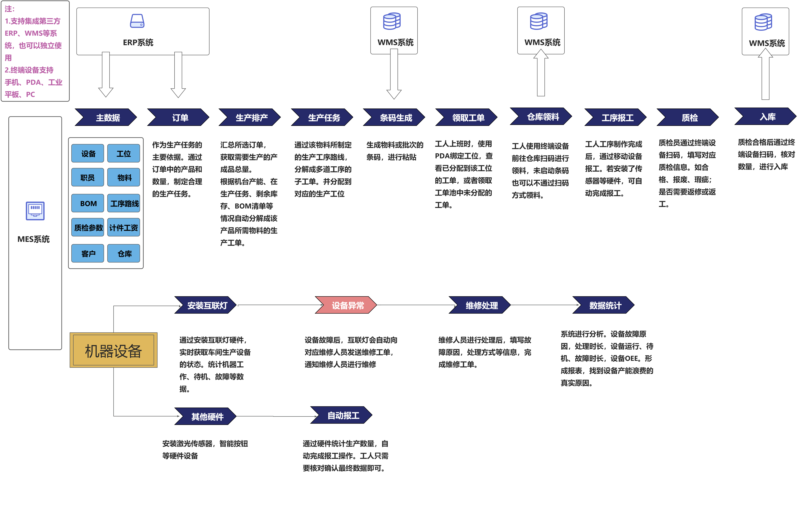

#### 系统架构

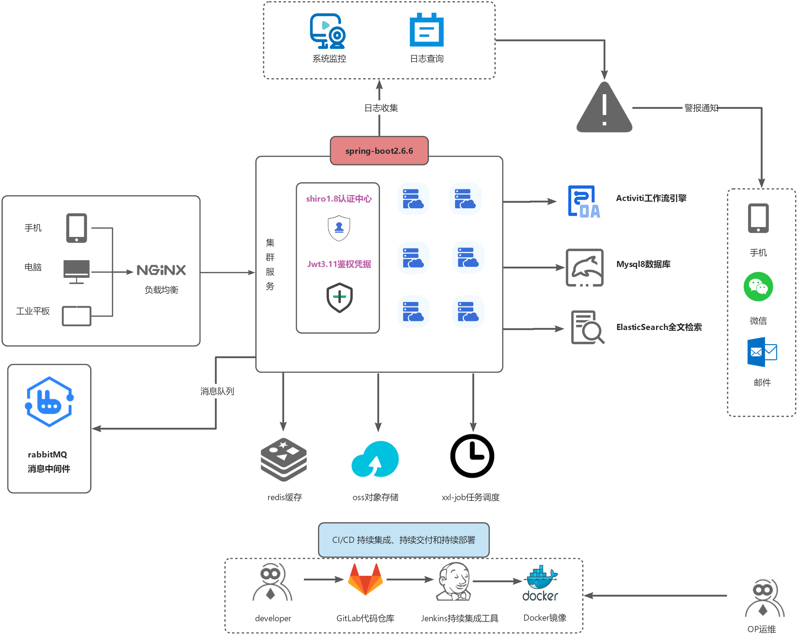

* 前端采用Vue、Element UI。
* 后端采用Spring Boot、Spring Security、Redis & Jwt。
* 权限认证使用Jwt，支持多终端认证系统。
* 高效率开发，使用代码生成器可以一键生成前后端代码。
* 特别鸣谢：[ruoyi-vue](https://gitee.com/y_project/RuoYi-Vue) ，[JimuReport](https://github.com/jeecgboot/JimuReport)，[element](https://gitee.com/link?target=https%3A%2F%2Fgithub.com%2FElemeFE%2Felement)，[vue-element-admin](https://gitee.com/link?target=https%3A%2F%2Fgithub.com%2FPanJiaChen%2Fvue-element-admin)，[eladmin-web](https://gitee.com/link?target=https%3A%2F%2Fgithub.com%2Felunez%2Feladmin-web)。
* 技术文档：待更新，可以先参考[若依框架](http://doc.ruoyi.vip/ruoyi-vue/)。
* 移动端仓库：[yjh-mes-uniapp](https://gitee.com/Jintiago/yjh-mes-uniapp)

## 🎯 演示图

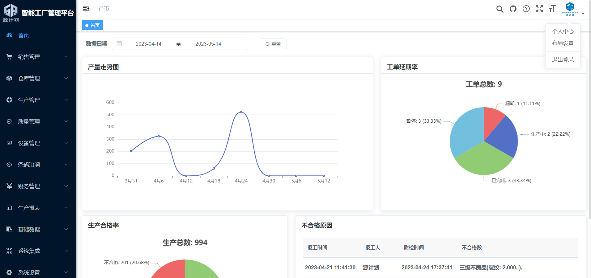

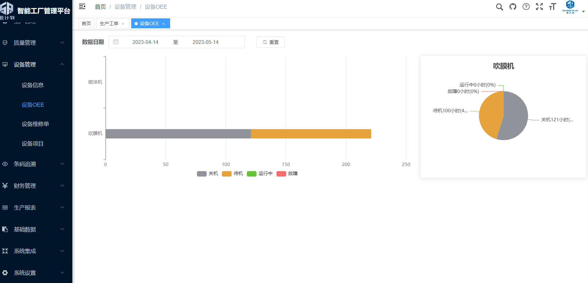

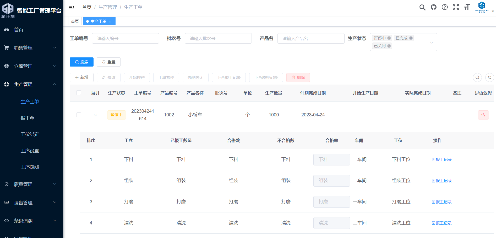

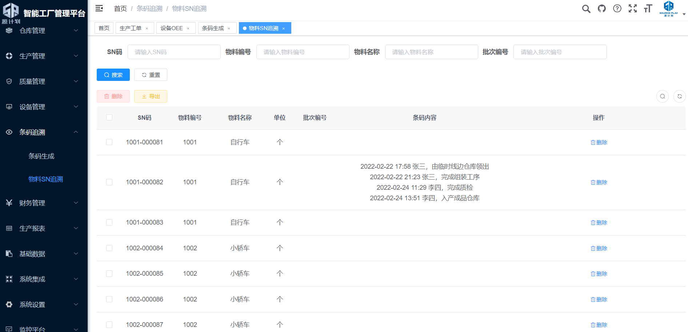

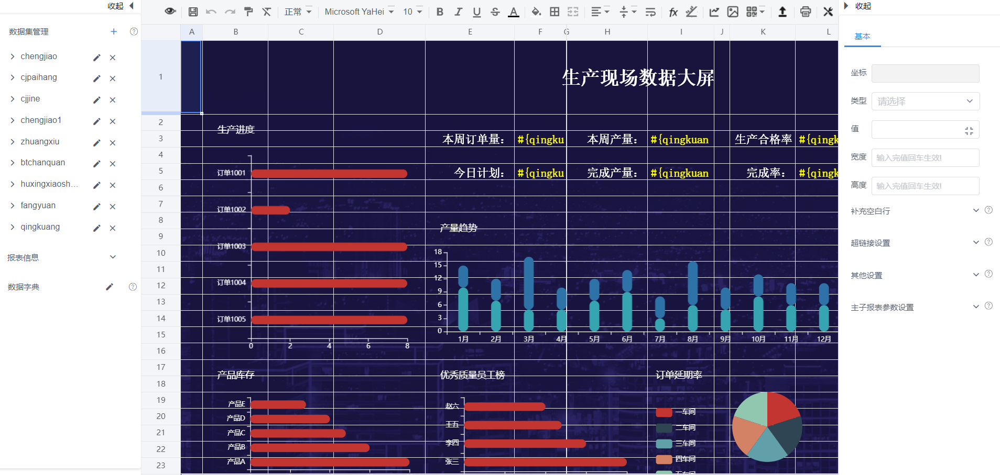

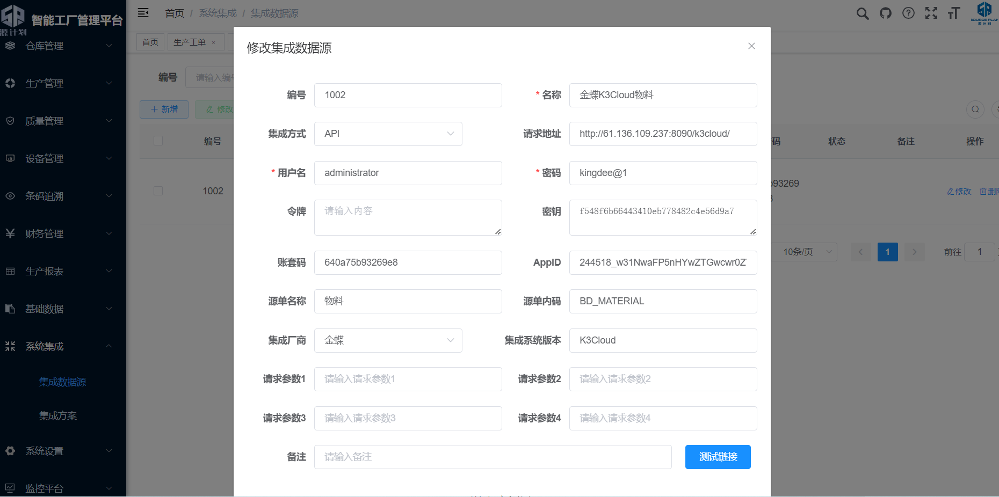

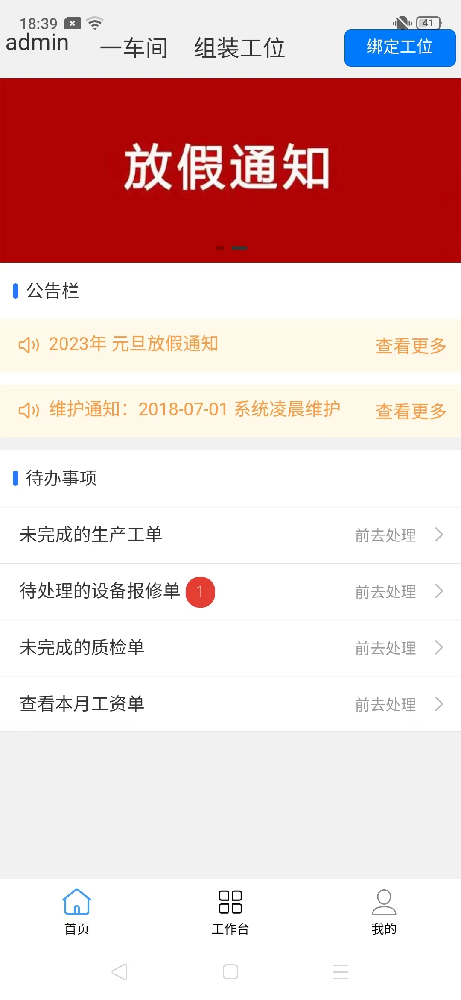     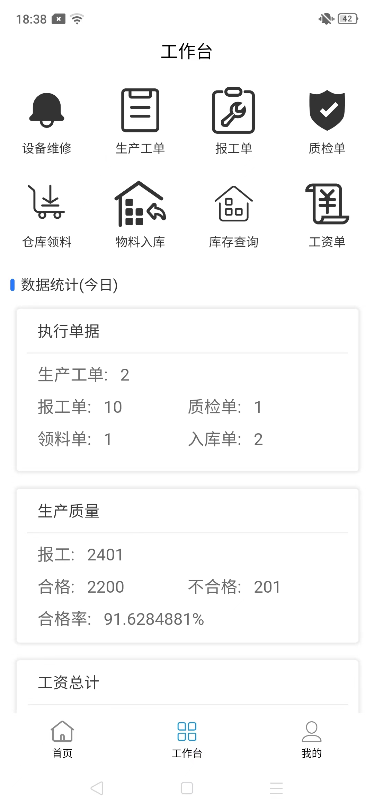     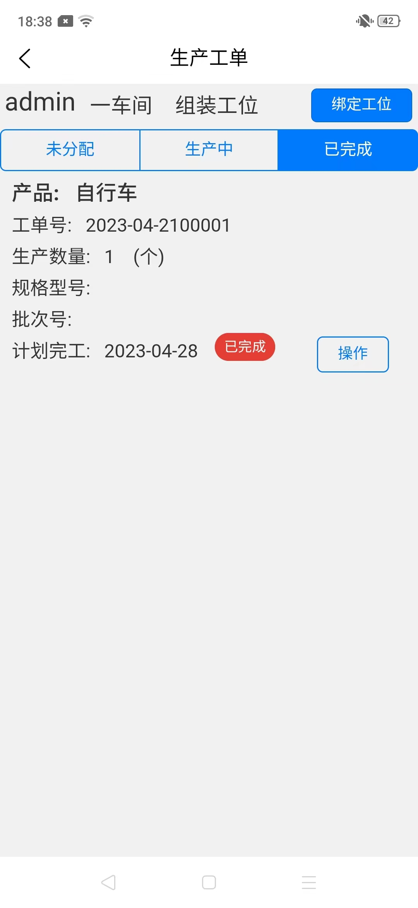  

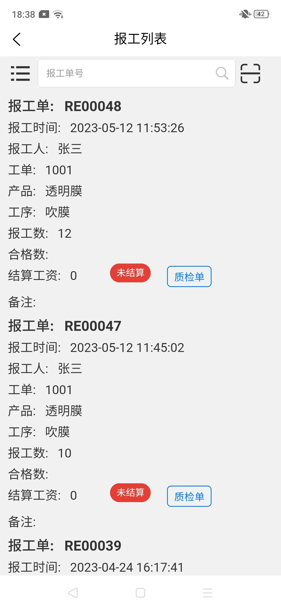     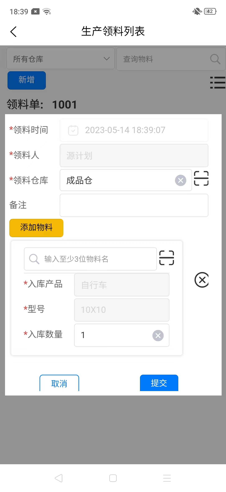       

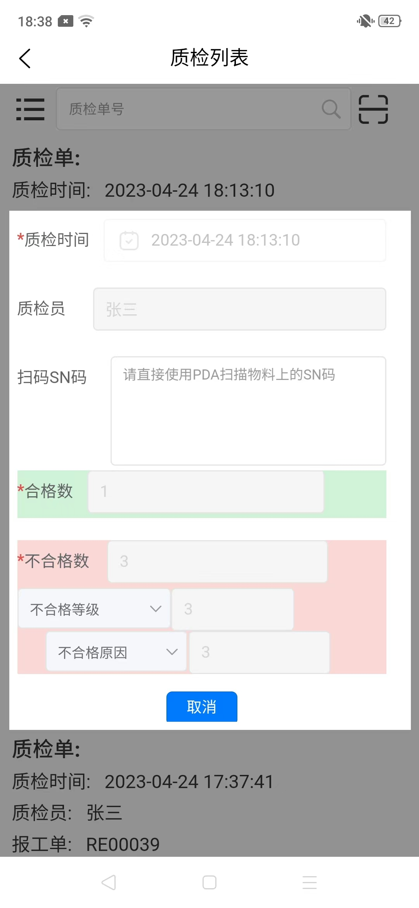 

## 🎑 开源版与商用版

1. 商业版本提供全套进销存+生产+财务一体化模块。
1. 开源版不再提供更新服务。
1. 商业版比开源版多了委外加工、MRP运算、自定义字段、高级筛选、单据转换、审批流等功能。
1. 商业版在几十家企业经过两年以上的商用落地，开源版为内测的demo版没有进行过商用落地。
1. 商业版本提供1对1技术支持，版本更新等服务。
#### 总结：
开源版适合学生拿来做个毕设，不适合直接用于企业商用。
## 🤝 商业服务

提供商业服务：
部署安装；软件实施；二次开发；

可以微信联系【**jinzhong373**】。

